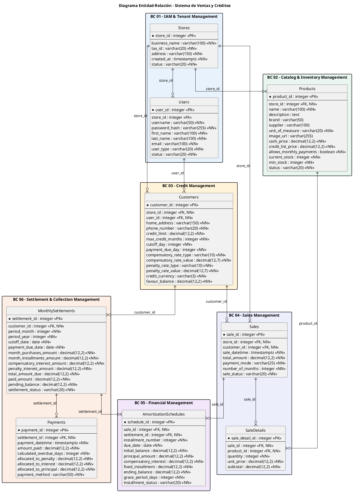

```plantuml
@startuml
title Diagrama Entidad-Relación - Sistema de Ventas y Créditos

hide circle
skinparam linetype ortho
skinparam packageStyle rectangle

skinparam entity {
    BackgroundColor #F5F5F5
    BorderColor #32658C
    FontColor #222222
}

' ==================================================
' BC 01 - IAM & TENANT MANAGEMENT
' ==================================================

package "BC 01 - IAM & Tenant Management" #E8F2FC {

    entity "Stores" as Stores {
        * store_id : integer <<PK>>
        --
        business_name : varchar(100) <<NN>>
        tax_id : varchar(20) <<NN>>
        address : varchar(150) <<NN>>
        created_at : timestamptz <<NN>>
        status : varchar(20) <<NN>>
    }

    entity "Users" as Users {
        * user_id : integer <<PK>>
        --
        store_id : integer <<FK>>
        username : varchar(50) <<NN>>
        password_hash : varchar(255) <<NN>>
        first_name : varchar(100) <<NN>>
        last_name : varchar(100) <<NN>>
        email : varchar(100) <<NN>>
        user_type : varchar(20) <<NN>>
        status : varchar(20) <<NN>>
    }
}

' ==================================================
' BC 02 - CATALOG & INVENTORY MANAGEMENT
' ==================================================

package "BC 02 - Catalog & Inventory Management" #E8F6EF {

    entity "Products" as Products {
        * product_id : integer <<PK>>
        --
        store_id : integer <<FK, NN>>
        name : varchar(100) <<NN>>
        description : text
        brand : varchar(50)
        supplier : varchar(100)
        unit_of_measure : varchar(20) <<NN>>
        image_url : varchar(255)
        cash_price : decimal(12,2) <<NN>>
        credit_list_price : decimal(12,2) <<NN>>
        allows_monthly_payments : boolean <<NN>>
        current_stock : integer <<NN>>
        min_stock : integer <<NN>>
        status : varchar(20) <<NN>>
    }
}

' ==================================================
' BC 03 - CREDIT MANAGEMENT
' ==================================================

package "BC 03 - Credit Management" #FFF3D9 {

    entity "Customers" as Customers {
        * customer_id : integer <<PK>>
        --
        store_id : integer <<FK, NN>>
        user_id : integer <<FK, NN>>
        home_address : varchar(150) <<NN>>
        phone_number : varchar(20) <<NN>>
        credit_limit : decimal(12,2) <<NN>>
        max_credit_months : integer <<NN>>
        cutoff_day : integer <<NN>>
        payment_due_day : integer <<NN>>
        compensatory_rate_type : varchar(10) <<NN>>
        compensatory_rate_value : decimal(12,7) <<NN>>
        penalty_rate_type : varchar(10) <<NN>>
        penalty_rate_value : decimal(12,7) <<NN>>
        credit_currency : varchar(3) <<NN>>
        favour_balance : decimal(12,2) <<NN>>
    }
}

' ==================================================
' BC 04 - SALES MANAGEMENT
' ==================================================

package "BC 04 - Sales Management" #ECEEFC {

    entity "Sales" as Sales {
        * sale_id : integer <<PK>>
        --
        store_id : integer <<FK, NN>>
        customer_id : integer <<FK, NN>>
        sale_datetime : timestamptz <<NN>>
        total_amount : decimal(12,2) <<NN>>
        payment_mode : varchar(25) <<NN>>
        number_of_months : integer <<NN>>
        sale_status : varchar(20) <<NN>>
    }

    entity "SaleDetails" as SaleDetails {
        * sale_detail_id : integer <<PK>>
        --
        sale_id : integer <<FK, NN>>
        product_id : integer <<FK, NN>>
        quantity : integer <<NN>>
        unit_price : decimal(12,2) <<NN>>
        subtotal : decimal(12,2) <<NN>>
    }
}

' ==================================================
' BC 05 - FINANCIAL MANAGEMENT
' ==================================================

package "BC 05 - Financial Management" #F2E6FA {

    entity "AmortizationSchedules" as AmortizationSchedules {
        * schedule_id : integer <<PK>>
        --
        sale_id : integer <<FK, NN>>
        settlement_id : integer <<FK, NN>>
        installment_number : integer <<NN>>
        due_date : date <<NN>>
        initial_balance : decimal(12,2) <<NN>>
        principal_amount : decimal(12,2) <<NN>>
        compensatory_interest : decimal(12,2) <<NN>>
        fixed_installment : decimal(12,2) <<NN>>
        ending_balance : decimal(12,2) <<NN>>
        grace_period_days : integer <<NN>>
        installment_status : varchar(20) <<NN>>
    }
}

' ==================================================
' BC 06 - SETTLEMENT & COLLECTION MANAGEMENT
' ==================================================

package "BC 06 - Settlement & Collection Management" #FCEDE5 {

    entity "MonthlySettlements" as MonthlySettlements {
        * settlement_id : integer <<PK>>
        --
        customer_id : integer <<FK, NN>>
        period_month : integer <<NN>>
        period_year : integer <<NN>>
        cutoff_date : date <<NN>>
        payment_due_date : date <<NN>>
        month_purchases_amount : decimal(12,2) <<NN>>
        month_installments_amount : decimal(12,2) <<NN>>
        compensatory_interest_amount : decimal(12,2) <<NN>>
        penalty_interest_amount : decimal(12,2) <<NN>>
        total_amount_due : decimal(12,2) <<NN>>
        paid_amount : decimal(12,2) <<NN>>
        pending_balance : decimal(12,2) <<NN>>
        settlement_status : varchar(20) <<NN>>
    }

    entity "Payments" as Payments {
        * payment_id : integer <<PK>>
        --
        settlement_id : integer <<FK, NN>>
        payment_datetime : timestamptz <<NN>>
        amount_paid : decimal(12,2) <<NN>>
        calculated_overdue_days : integer <<NN>>
        allocated_to_penalty : decimal(12,2) <<NN>>
        allocated_to_interest : decimal(12,2) <<NN>>
        allocated_to_principal : decimal(12,2) <<NN>>
        payment_method : varchar(50) <<NN>>
    }
}

' ==================================================
' RELACIONES ORIGINALES - SIN MODIFICACIONES
' ==================================================

Stores ||--o{ Users : "store_id"
Stores ||--o{ Customers : "store_id"
Stores ||--o{ Products : "store_id"
Stores ||--o{ Sales : "store_id"

Users ||--o{ Customers : "user_id"

Customers ||--o{ Sales : "customer_id"
Customers ||--o{ MonthlySettlements : "customer_id"

Sales ||--o{ SaleDetails : "sale_id"
Products ||--o{ SaleDetails : "product_id"

Sales ||--o{ AmortizationSchedules : "sale_id"

MonthlySettlements ||--o{ AmortizationSchedules : "settlement_id"
MonthlySettlements ||--o{ Payments : "settlement_id"

@enduml
```
